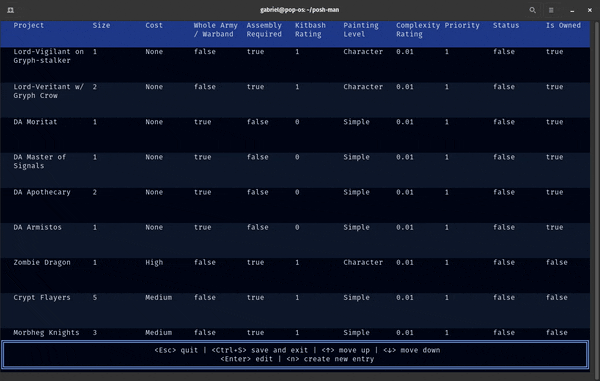

# PoSh Man - Pile-of-Shame Manager

> Pile-of-Shame: A backlog of un-built and un-painted miniatures common in miniature painting and wargaming hobbies.

Rust-based TUI I built to learn Rust! you can use it for logging and prioritising miniature-painting projects based on size, complexity and corporate fibonacci scoring shenanigans.



## File Structure
```
├── Cargo.lock
├── Cargo.toml
├── LICENSE
├── project                    //hold project struct            
│   ├── Cargo.lock
│   ├── Cargo.toml
│   └── src
│       └── lib.rs
├── README.md
├── src
   ├── app.rs
   ├── main.rs
   ├── event_handlers         //events for the corresponding UIs
   │   ├── input_handlers.rs
   │   ├── main_handlers.rs
   │   └── mod.rs
   └── ui                     //ui rendering for the different screens
       ├── input_ui.rs
       ├── main_ui.rs
       └── mod.rs
```
## Input Data

Good news, PoSh Man will generate an empty file if you don't have one it the same directory, or if you don't specify one! For reference accepts a CSV file with the following headers:

>project_name,size,cost,whole_army,needs_assembly,kitbash_rating,paint_level,complexity_rating,priority,status,is_owned

The plus side of this is that if you decide to behave like a normal person and use spreadsheet software, the files PoSh Man generates should be compatible.

## Usage

**NOTE - PoSh Man is currently in construction, so expect limited functionality,**

```cargo run display <OPTIONAL> -d <filepath of table>```

Displays PoSh table

### Planned features

```cargo run new <OPTIONAL> -d <filepath of table>```

Creates empty PoSh table

```cargo run add "<data_record in string format>"```

- ~~Add new entry~~
- ~~edit existing entries~~
- **Add unit tests <- in progress**
- **Sort entries by priorty, then later by attribute**
